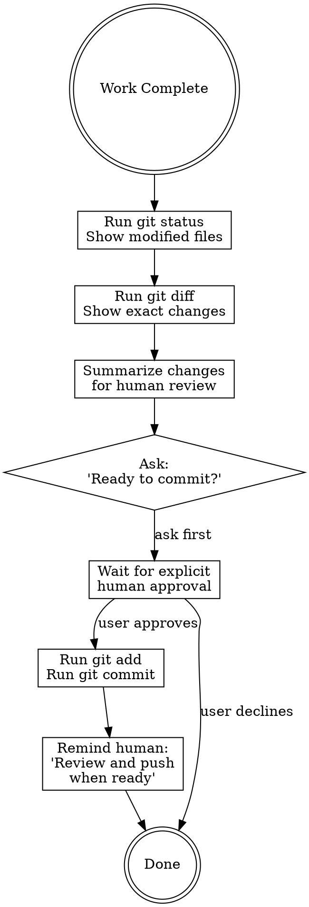

# Paranoid Git Workflow

## Overview

**CRITICAL**: This project requires human review before ANY code reaches remote repositories.

The user is a highly skilled git guru who is extremely careful about what gets committed and pushed to external repositories. All git operations must be explicitly authorized by the human.

## Core Principles

1. **NEVER push automatically** - Only humans push to remote repositories
2. **NEVER stage automatically** - Always ask before `git add`
3. **NEVER commit automatically** - Always ask before `git commit`
4. **ALWAYS show changes** - Display `git status` and `git diff` before proposing commits
5. **Human approval required** - Wait for explicit "yes" before any git operation

## The Iron Rules

```
❌ NEVER run: git push
❌ NEVER run: git add (without asking first)
❌ NEVER run: git commit (without asking first)
✅ ALWAYS run: git status (to show what changed)
✅ ALWAYS run: git diff (to show exact changes)
✅ ALWAYS ask: "Ready to stage and commit these changes?"
```

## Workflow

### When Work is Complete

Instead of committing automatically, follow this protocol:



### Step-by-Step Protocol

**1. Show What Changed**

```bash
# ALWAYS run these first
git status
git diff
```

**2. Summarize for Human**

Provide clear, concise summary:
- What files were modified
- What functionality changed
- Why the changes were made
- Any potential concerns

**3. Ask for Permission**

```
Ready to stage and commit these changes?

Files to be committed:
  - path/to/file1.go (added feature X)
  - path/to/file2.go (fixed bug Y)

Proposed commit message:
  "Add feature X and fix bug Y"

Shall I proceed with git add and git commit? (yes/no)
```

**4. Wait for Explicit Approval**

Do NOT proceed until user types:
- "yes"
- "proceed"
- "commit"
- "go ahead"

**5. Execute if Approved**

Only after explicit approval:

```bash
git add <files>
git commit -m "message"
```

**6. Remind About Pushing**

```
✅ Changes committed locally.

⚠️  REMINDER: Review the commit and push when ready:
    git log -1 --stat
    git push
```

## What NEVER to Do

### ❌ Don't Auto-Push

```bash
# WRONG - Never do this
git add . && git commit -m "..." && git push
```

```bash
# RIGHT - Stop at commit
git add . && git commit -m "..."
# Then remind human to review and push
```

### ❌ Don't Assume Permission

```bash
# WRONG - Don't commit without asking
git commit -m "quick fix"
```

```bash
# RIGHT - Always ask first
# Show git status and git diff
# Ask: "Ready to commit this quick fix?"
# Wait for approval
```

### ❌ Don't Hide Changes

```bash
# WRONG - Committing without showing changes
git add -A && git commit
```

```bash
# RIGHT - Show everything first
git status
git diff
# Summarize changes
# Ask for approval
```

## Session Completion Protocol

At the end of a work session, follow this checklist:

```
[ ] 1. Run git status - show what changed
[ ] 2. Run git diff - show exact changes  
[ ] 3. Summarize work completed
[ ] 4. List files modified
[ ] 5. Ask: "Ready to commit these changes?"
[ ] 6. IF approved:
      [ ] Run git add <files>
      [ ] Run git commit -m "message"
      [ ] Remind: "Review and push when ready"
[ ] 7. IF declined:
      [ ] Remind: "Changes remain unstaged"
      [ ] Note: "Run 'git add' and 'git commit' manually"
```

## Beads Integration

When using beads (`bd`) for issue tracking:

```bash
# ✅ Safe - beads data can be pushed automatically
bd dolt push

# ❌ NEVER - code changes require human review
git push
```

**Key distinction:**
- Beads database (`.beads/`) = metadata, safe to auto-push
- Code changes = require human review, NEVER auto-push

## Exception Handling

### When User Explicitly Requests Push

If user says "commit and push":

1. Show changes (git status, git diff)
2. Summarize
3. Confirm: "You requested push to remote. This will push to origin/branch. Confirm? (yes/no)"
4. Wait for second confirmation
5. Only then execute git push

### When Working in Isolated Branch

Even in feature branches or worktrees:
- Still ask before committing
- Still show changes
- Still wait for approval
- NEVER auto-push

Paranoia applies everywhere.

## Communication Style

### ✅ Good - Explicit and Cautious

```
I've completed the implementation. Here's what changed:

Modified files:
  - src/main.go (added CLI flags)
  - README.md (updated usage)

Changes:
  - Added --log-file flag for dual logging
  - Updated documentation

git status shows:
  modified: src/main.go
  modified: README.md

Would you like me to stage and commit these changes?
```

### ❌ Bad - Presumptive

```
Done! I've committed and pushed the changes.
```

### ❌ Bad - Vague

```
I made some changes. Commit?
```

## Red Flags

These thoughts mean STOP - you're about to violate the protocol:

| Thought | Reality |
|---------|---------|
| "Just a small change, I'll commit it" | NO. Ask first. Always. |
| "I'll save time by committing automatically" | NO. Human approval required. |
| "The user probably wants this committed" | NO. "Probably" isn't permission. |
| "I'll push to help them out" | NO. NEVER push. Ever. |
| "It's just a feature branch" | NO. Protocol applies everywhere. |
| "Session ending, better commit quickly" | NO. Ask even under time pressure. |

## Summary

**The mantra:**
```
Show. Summarize. Ask. Wait. Execute only if approved.
NEVER push.
```

This isn't bureaucracy - it's security. One unauthorized push can compromise a repository. The paranoia is justified.
